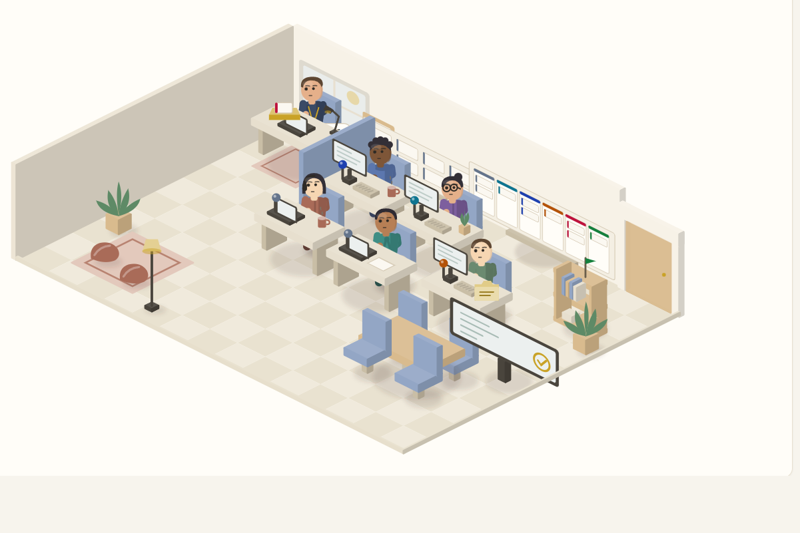

# Agile Sprint

<p align="center">
  
</p>
<p align="center"><i>Your sprint, as a room. Every desk, beacon and card is driven by your real delivery files —
and in the <a href="docs/guide.html">guide</a> this office is live and clickable.</i></p>

Agile delivery run end to end by an AI crew, inside Claude Code.

A Product Owner talks to a Business Analyst, stories get groomed and estimated independently,
a Scrum Master plans and orchestrates, a developer builds, and a **blind tester on a different
model** decides whether the work is done. Nothing ships without the delivery owner's recorded
words. The whole thing runs over plain files in your repo, and publishes a **sprint board** and
an isometric **Sprint Office** you can watch and click.

**[Read the illustrated guide](docs/GUIDE.md)** — how it all works, in pictures.

*(GitHub only ever shows `.html` as source code, so the guide you read here is markdown. The
**living** version — [`docs/guide.html`](docs/guide.html), with the office actually running and
clickable — needs to be opened from a checkout: `python -m http.server 8080`, then
http://localhost:8080/docs/guide.html)*

## Install

```
/plugin marketplace add VoxnexAI/agile-sprint
/plugin install agile-sprint@agile-sprint
```

## Use

```
/agile-sprint:sprint                          # lists deliveries, asks which
/agile-sprint:sprint <delivery> office        # the visual way in
/agile-sprint:sprint <delivery> status        # board + written status
/agile-sprint:sprint <delivery> groom         # backlog interview -> stories
/agile-sprint:sprint <delivery> plan          # plan the next sprint
/agile-sprint:sprint <delivery> run           # build/test loop
/agile-sprint:sprint <delivery> showcase      # sign-off gate
/agile-sprint:sprint <delivery> retro         # retrospective
/agile-sprint:sprint crew                     # rename the crew, just for you
```

## What lives where

| Layer | Where | Why |
|---|---|---|
| **The agile engine** — laws, phases, board and office renderers | this plugin | generic, reusable, versioned independently |
| **Project rails** — `sprint/RAILS.md` | each project | every project's gates differ (type checks, migrations, deploy rules, environment hazards) |
| **Delivery state** — `sprint/deliveries/**`, `sprint/crew.md` | each project | it is that project's record, and belongs in its history |

That separation is the point: the plugin never needs a release just because a project changed,
and a project never risks its production pipeline to update the tool.

**Law 6 is deliberately empty here.** Each project supplies its own gates in `sprint/RAILS.md`,
and the skill refuses to invent them: if the file is missing it says so and asks the owner before
any story reaches `build`.

## Requirements

- Claude Code
- Python 3 (standard library only — nothing to install)

## The board and the office

Both are generated from the same `office-state.json`, built by the board's own parsers, so the
two views can never disagree. The office is a small app — Office, Board, Backlog, Sprint, Story
and Ask-the-crew screens — published as a private artifact. Tapping "Ask the crew" records a
request on the page that the next session picks up.

Going live is never a button: approval is the owner's words, recorded verbatim in the showcase.
