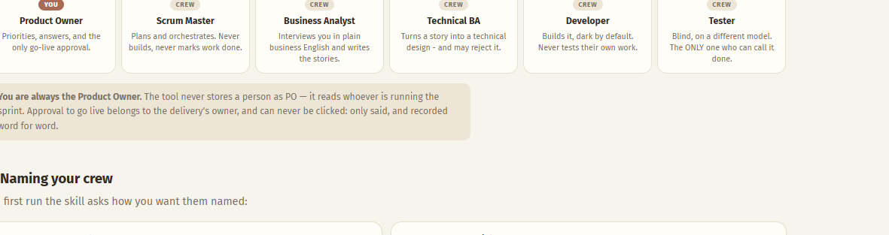
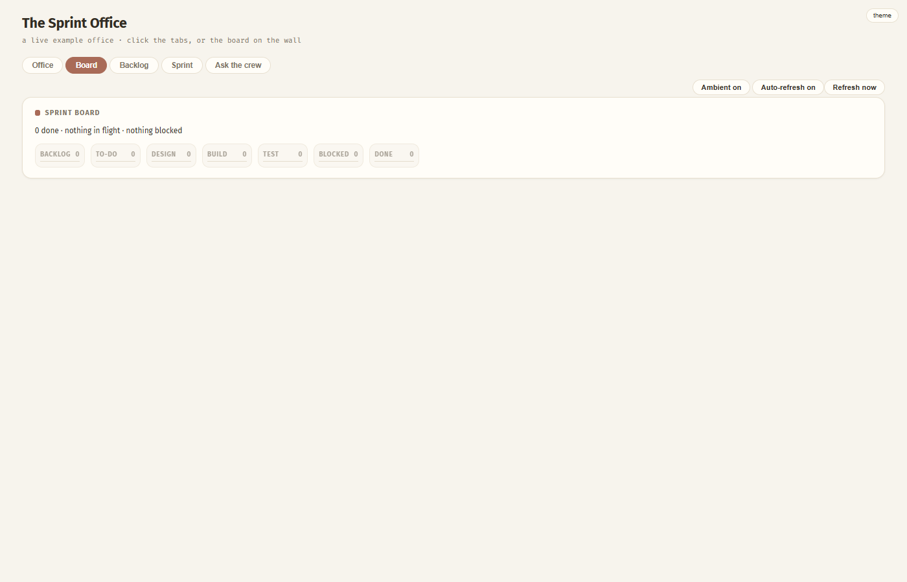
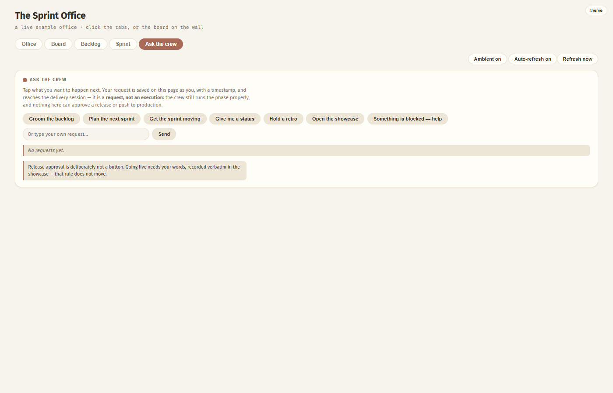

# Agile Sprint — how it works

<p align="center">
  
</p>

A full agile delivery crew, inside Claude Code. **You are the Product Owner.** They groom, plan,
build and test — and nothing ships without your say-so.

> **Want the living version?** This page is the GitHub-readable guide. The real one —
> [`docs/guide.html`](guide.html) — has the office **running**: the crew breathe, blink and type,
> and the tabs work. GitHub only ever shows HTML as source code, so open it locally instead:
> ```bash
> git clone https://github.com/VoxnexAI/agile-sprint.git
> cd agile-sprint && python -m http.server 8080
> # then open http://localhost:8080/docs/guide.html
> ```

---

## Three lines to a running sprint office

```
/plugin marketplace add VoxnexAI/agile-sprint
/plugin install agile-sprint@agile-sprint
/agile-sprint:sprint <your-project> office
```

## The idea in one minute

You talk to a Business Analyst in plain English. Stories get written, estimated independently,
and **frozen** before anyone builds. A developer builds; a **different model**, given only the
story and its frozen acceptance criteria, decides whether it passes. Work becomes "done" one way
only — by that blind tester saying so.

`Backlog → Groomed → Design → Build → Test → Done → Shipped`

Every one of those moves is written to an event log, so the board and the office are never
someone's summary of the work — they are the work.

## Who you are working with

<p align="center"></p>

| Role | Who | What they do |
|---|---|---|
| **Product Owner** | **You** | Priorities, answers, and the only go-live approval |
| Scrum Master | Crew | Plans and orchestrates. Never builds, never marks work done |
| Business Analyst | Crew | Interviews you in plain business English and writes the stories |
| Technical BA | Crew | Turns a story into a technical design — and may reject it |
| Developer | Crew | Builds it, dark by default. Never tests their own work |
| Tester | Crew | Blind, on a different model. The ONLY one who can call it done |

**You are always the Product Owner.** The tool never stores a person as PO — it reads whoever is
running the sprint. Approval to go live belongs to the delivery's owner, and can never be
clicked: only said, and recorded word for word.

## Naming your crew

On first run the skill asks how you want them named:

- **Name them yourself** — give any or all of the five names; anything you leave out is filled in,
  so you never end up with a blank seat.
- **Let the system pick** — a cast is drawn for you. Each name arrives with its own character
  (hair, colouring, everything), so the person on the board always looks the way the name reads.

```bash
python scripts/sprint_crew.py --root sprint --random
python scripts/sprint_crew.py --root sprint --names "SM=Alex,BA=Sam,Dev=Kim"
```

Want your own names without changing them for teammates? The `crew` phase writes a personal
override only you see.

## The commands

`…` below is shorthand for `/agile-sprint:sprint`.

| Command | What happens |
|---|---|
| `/agile-sprint:sprint` | Lists your deliveries and asks which one |
| `… <delivery> office` | **The visual way in** — publishes the office and hands you the link |
| `… <delivery> status` | The board, plus a short written status |
| `… <delivery> groom` | The BA interviews you and turns ideas into stories |
| `… <delivery> plan` | Pulls the smallest set that achieves one goal |
| `… <delivery> run` | Design → build → blind test, story by story |
| `… <delivery> showcase` | The go-live gate. Your words are recorded verbatim |
| `… <delivery> retro` | What worked, what didn't, and the velocity line |
| `… crew` | Rename the crew, just for you |

## The office is the app

<p align="center"></p>

The office is the home screen of a small application. The board on the wall, the shelf by the
door and the showcase screen are all clickable, and so is every card:

- **Board** — your real columns and cards; click one for its task checklist
- **Backlog** — groomed stories and raw ideas, with risk called out
- **Sprint** — points, the goal, and a timestamped activity feed
- **Ask the crew** — tap what you want next; it is saved on the page as you, and picked up next
  session

<p align="center"></p>

A tap is a **request, not an execution**. The crew still run the phase properly, every gate still
applies, and release approval is deliberately not a button.

## What the crew will not do

| Rule | Why it exists |
|---|---|
| Nobody verifies their own work | The tester is a fresh, blind session on a different model, and never sees the developer's reasoning |
| The BA never answers for you | An open question halts the story rather than being guessed |
| Acceptance criteria freeze at planning | Later changes are logged as scope changes and shown at showcase — never silently |
| Defects are never hidden | Serious ones block the sprint; anything deferred is listed with your quote accepting it |
| Your project's own gates are binding | Type checks, migrations, deploy rules — whatever your project's `sprint/RAILS.md` says must actually run and pass |

## Where things live

| What | Where | Why |
|---|---|---|
| The engine — laws, phases, renderers | this plugin | Generic and reusable; updating it never touches your project |
| Your gates — `sprint/RAILS.md` | your project | Every project's rules differ |
| Delivery state — stories, sprints, events | your project | It is your record, and belongs in your history |

Plain files, all of it. Any session picks up where the last one stopped by reading them — nothing
important lives only in a conversation.

---

*The images above are generated from the same code that publishes your sprint office, so this
page always shows the current artwork. Rebuild everything with `python scripts/build_guide.py`.*
